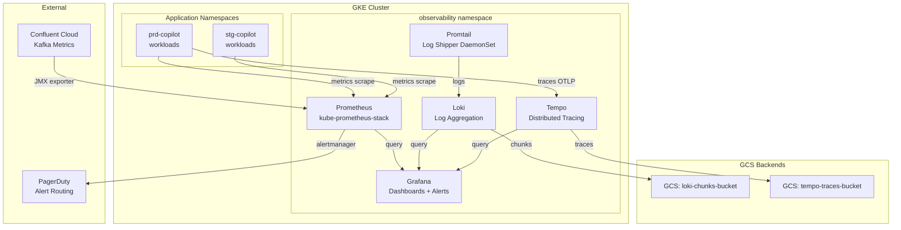

# GKE Observability Stack
> Full observability stack on GKE: Prometheus + Grafana + Loki + Tempo with Workload Identity and Kustomize overlays.

    

    

Helm values + Terraform for deploying a full observability stack on GKE:
**Prometheus + Grafana + Loki + Tempo** with Workload Identity, Kustomize overlays, and sample dashboards.

Fork this repo and adapt to your GKE project.

---

## Architecture



---

## Stack Versions

| Component | Chart | Version |
|-----------|-------|---------|
| kube-prometheus-stack | prometheus-community/kube-prometheus-stack | 58.x |
| Loki | grafana/loki | 6.x |
| Tempo | grafana/tempo-distributed | 1.x |
| Grafana (included in kube-prometheus-stack) | — | 10.x |

---

## Repository Structure

```
gke-observability-stack/
├── README.md
├── terraform/
│   ├── gke-cluster/          # GKE cluster provisioning (optional)
│   └── workload-identity/    # GCP SA + WI binding for monitoring
├── helm/
│   └── values/
│       ├── prometheus.yaml
│       ├── loki.yaml
│       ├── tempo.yaml
│       └── grafana-dashboards.yaml
├── kustomize/
│   ├── base/
│   └── overlays/
│       ├── stg/
│       └── prd/
├── dashboards/
│   ├── gke-cluster-overview.json
│   ├── kafka-consumer-lag.json
│   ├── llm-service-latency.json
│   └── ecs-to-gke-migration.json
└── docs/
    ├── architecture.md
    └── alerting-rules.md
```

---

## Quick Start

```bash
# 1. Create GCP SA + Workload Identity binding
cd terraform/workload-identity
terraform init && terraform apply

# 2. Install kube-prometheus-stack
helm repo add prometheus-community https://prometheus-community.github.io/helm-charts
helm repo update
helm upgrade --install prometheus prometheus-community/kube-prometheus-stack \
  -n observability --create-namespace \
  -f helm/values/prometheus.yaml

# 3. Install Loki
helm repo add grafana https://grafana.github.io/helm-charts
helm upgrade --install loki grafana/loki \
  -n observability \
  -f helm/values/loki.yaml

# 4. Install Tempo
helm upgrade --install tempo grafana/tempo-distributed \
  -n observability \
  -f helm/values/tempo.yaml

# 5. Import dashboards
kubectl apply -k kustomize/overlays/prd
```

## Author

**Pranav Bansal** — AI Infrastructure & SRE Engineer

[](https://linkedin.com/in/okpranavbansal)
[](https://github.com/okpranavbansal)