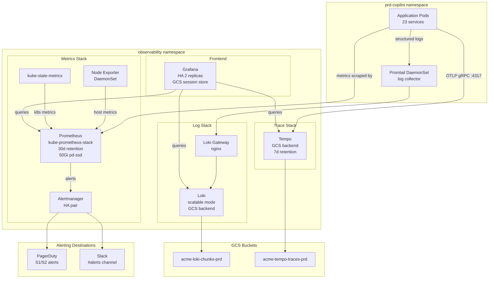

# GKE Observability Stack Architecture

## Overview



---

## Component Sizing

| Component | Replicas | CPU Request | Memory Request | Storage |
|-----------|----------|-------------|---------------|---------|
| Prometheus | 1 | 500m | 2Gi | 50Gi pd-ssd |
| Alertmanager | 2 | 100m | 256Mi | 1Gi pd-standard |
| Grafana | 2 | 250m | 512Mi | — (GCS session) |
| Loki (write) | 3 | 500m | 1Gi | — (GCS) |
| Loki (read) | 2 | 250m | 512Mi | — |
| Tempo | 1 | 500m | 1Gi | — (GCS) |
| Promtail | 1/node | 100m | 128Mi | — |

---

## Retention Policies

| Signal | prd | stg |
|--------|-----|-----|
| Metrics | 30 days | 7 days |
| Logs | 30 days (GCS lifecycle) | 7 days |
| Traces | 7 days | 3 days |

---

## Workload Identity Setup

All observability components use Workload Identity to access GCS — no static credentials.

```
Kubernetes SA: loki-sa (observability ns) → GCP SA: loki@prj-acme-prd.iam.gserviceaccount.com
  └─ roles/storage.objectAdmin on acme-loki-chunks-prd

Kubernetes SA: tempo-sa (observability ns) → GCP SA: tempo@prj-acme-prd.iam.gserviceaccount.com
  └─ roles/storage.objectAdmin on acme-tempo-traces-prd
```

See `terraform/workload-identity/main.tf`.

---

## Alerting Coverage

See `docs/alerting-rules.md` for the full list. Key categories:
1. **Infrastructure**: Node CPU/memory/disk, pod restarts
2. **Application**: HTTP error rate, P99 latency, unhealthy deployments
3. **Kafka**: Consumer lag, broker unavailability
4. **LLM**: First-token latency, Bedrock throttling
5. **Certificates**: Expiry < 30d, < 7d
6. **Error budgets**: Burn rate alerts (fast burn and slow burn)
